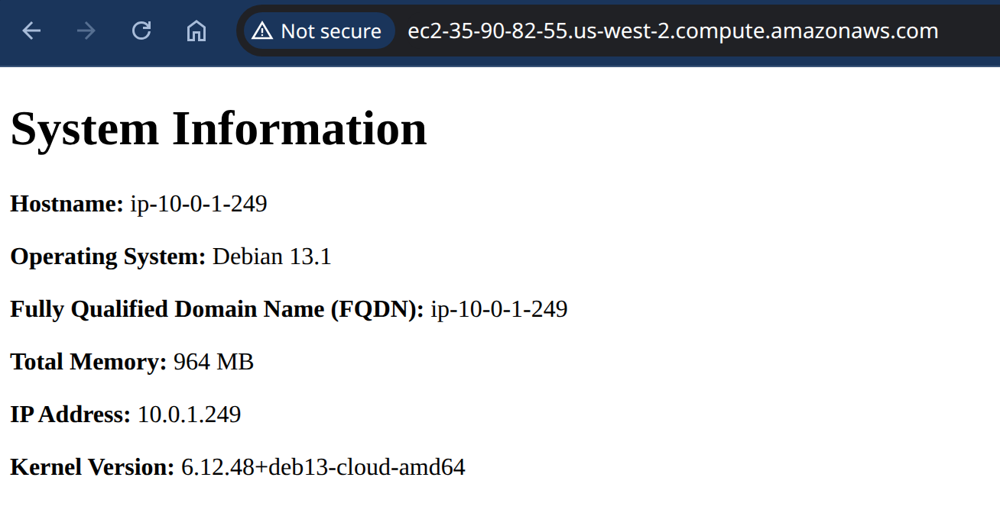

# intro-to-ansible-lab-files
## Create new Key
```sh
# create new key
ssh-keygen -t ed25519 -f ~/.ssh/aws
```
## import new key to aws and delete new key
```sh
# import key using script
./scripts/import_lab_key ~/.ssh/aws.pub
# delete key
./scripts/delete_lab_key
```

## terraform commands
```sh
# go to terraform directory
cd terraform 
# run terraform commands
terraform init
# format terraform files
terraform fmt
# validate terraform files
terraform validate
# plan terraform changes
terraform plan --out plan
# apply terraform changes
terraform apply plan
```

## Ansible commands
```sh
# go to ansible directory
cd ../ansible
# check syntax
ansible-playbook --syntax-check "playbook.yml"
# run playbook
ansible-playbook "playbook.yml"
```
## clean up terraform created resources
```sh
# go to terraform directory
cd ../terraform 
# destroy terraform created resources
terraform destroy 
```

